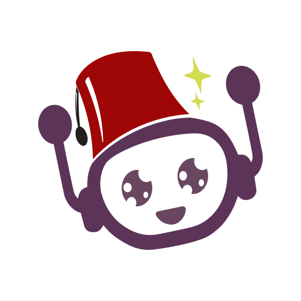
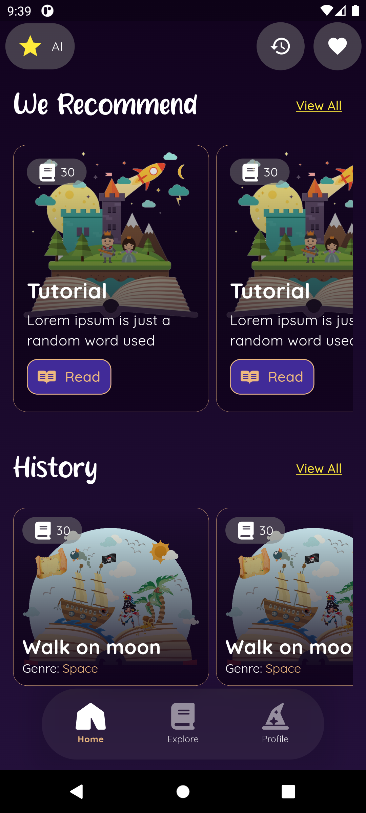
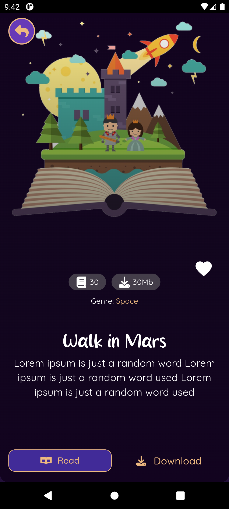
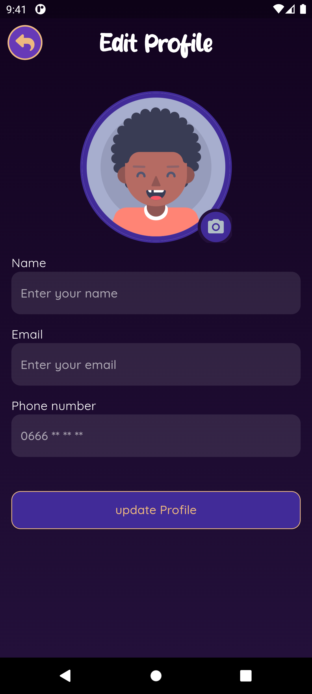

  

<h1 align="center">🌙 Hakawati AI</h1>

  <em>Bedtime stories powered by Flutter & Firebase</em> 
  
  
  

---

**Hakawati AI** is a Flutter application that brings bedtime stories to life using **Firebase Authentication** and beautiful, modern UI inspired by [this Behance design](https://www.behance.net/gallery/194532313/Bedtime-story-app-Znichka?tracking_source=search_projects%7Cznichka).

The app allows users to **sign up**, **log in**, and **update their profiles** via Firebase, while the rest of the app focuses on storytelling experiences built with Flutter’s elegant UI system.

---

## ✨ Features

- 🔐 **Firebase Authentication** — Sign up, log in, and manage user accounts.
- 👤 **Profile Update** — Edit and update user information.
- 🧸 **Beautiful UI** — Inspired by the _Znichka_ bedtime story app design.
- 📱 **Cross-Platform** — Runs smoothly on Android and iOS.
- 🪄 **Ready for AI Integration** — Future versions will generate and narrate AI-powered stories.

---

## 📸 Screenshots

| Home | Story Details | Profile |
|------|----------------|----------|
|  |  |  |

---

## 🧰 Tech Stack

- **Framework:** [Flutter](https://flutter.dev/)
- **Backend:** [Firebase Authentication](https://firebase.google.com/docs/auth)
- **State Management:** [Flutter Bloc](https://pub.dev/packages/flutter_bloc)
- **UI Reference:** [Behance — Znichka Bedtime Story App](https://www.behance.net/gallery/194532313/Bedtime-story-app-Znichka)

---
